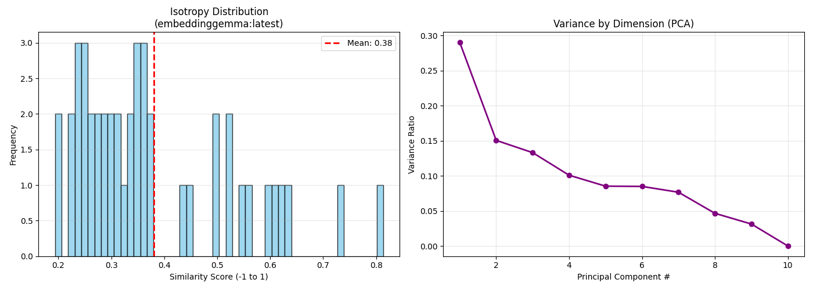

# This Covers The Test For Embedding Models

## Structure
    --tests
        --geometry
            isotropyScore.py

## Setup 
    Step 0: Download Ollama and Embdding Gemma Model from 
    https://ollama.com/download 
    
    Step 1 : Clone and Setup The Repository
    git clone git@github.com:harshkumar05/LLMEvaluation.git
    cd LLMEvaluation>
    
    Step 2 : Create a Python Virtual Environment (Python 3.9+)
    python3 -m venv .venv (if linux/mac)
    python -m venv .venv  (if windows)
 
    Step 3 : Activating The Virtual Environment
    source .venv/bin/activate (if linux/mac)
    .venv\Scripts\Activate.ps1 (if windows)

    Step 4: Install Dependencies All required packages are listed in requirements.txt.
    pip install --upgrade pip
    pip install -r requirements.txt

## Isotropy Score
To Check if the embeddings of an embedding model forms or corn or are distributed in space

    

    

